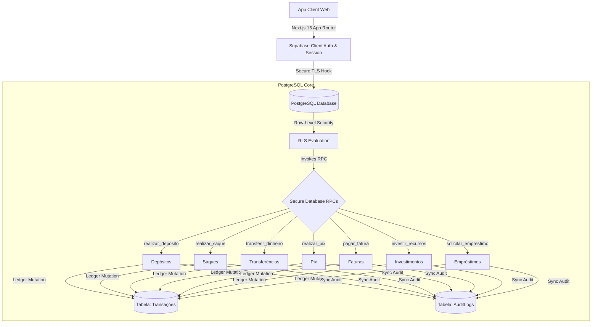

# 🏛️ Thallium Genérico | Digital Ledger & Banking Infrastructure Framework

[](https://nextjs.org/)
[](https://tailwindcss.com/)
[](https://www.typescriptlang.org/)
[](https://supabase.com/)
[](https://vercel.com/)

O **Thallium Genérico** é um framework enterprise **White-Label** de infraestrutura para bancos digitais, contas de pagamento e sistemas de ledger contábil de dupla entrada. Projetado com precisão clínica para alta integridade transacional, previne *race conditions* e saldo negativo através de procedures RPC atômicas executadas no PostgreSQL (Supabase).

---

## 🌟 Principais Funcionalidades (White-Label)

- 🔒 **Sistema de Contabilidade Atômica (Double-Entry Ledger):** Operações bancárias executadas diretamente via funções RPC atômicas no banco de dados.
- 💸 **Múltiplos Meios de Pagamento & Transferência:**
  - PIX (Chaves CPF, E-mail e Aleatória).
  - Transferências Internas e TED instantâneas.
  - Depósitos e Saques simulados.
- 💳 **Gestão de Cartões de Crédito Virtuais & Faturas:** Cartões 3D com limites configuráveis, bloqueio instantâneo e pagamento de faturas.
- 📈 **Módulo de Investimentos Renda Fixa:** Simulação e resgate de ativos (CDB, LCI, Tesouro Direto) com cálculo dinâmico de rendimentos.
- 🏦 **Financiamentos & Empréstimos:** Solicitação, aprovação automática e controle de prazos com taxa de juros.
- 🛡️ **Auditoria & Logs (AuditLogs):** Registro síncrono de todas as ações de mutação de saldo com IP e timestamp.
- 🎨 **Personalização de Marca em 1 Minuto:** Arquivo central de configuração `src/config/bank.config.ts` para alterar nome da instituição, cores, símbolos de moeda e limites padrão.

---

## 🛠️ Arquitetura do Banco de Dados (Supabase PostgreSQL)

A migration completa encontra-se em `supabase/migrations/20260710000000_create_thallium_tables.sql`.



---

## 🎨 Como Customizar a Sua Marca (White-Label)

Edite o arquivo `src/config/bank.config.ts`:

```typescript
export const bankConfig = {
  name: "Sua Fintech Bank",
  shortName: "FinTech",
  currency: "BRL",
  currencySymbol: "R$",
  features: {
    enablePix: true,
    enableVirtualCards: true,
    enableInvestments: true,
    enableLoans: true,
  },
  // ...
};
```

---

## 🚀 Como Subir para a Vercel

O projeto possui integração nativa e zero-config para a **Vercel**.

### Opção 1: Via GitHub (Recomendado)

1. Faça o fork ou importe este repositório `Taiwansz/Thallium-Generico` na Vercel.
2. Configure as Variáveis de Ambiente no painel da Vercel:
   - `NEXT_PUBLIC_SUPABASE_URL`
   - `NEXT_PUBLIC_SUPABASE_ANON_KEY`
3. Clique em **Deploy**!

### Opção 2: Via Vercel CLI

```bash
npx vercel --prod
```

---

## 💻 Desenvolvimento Local

### 1. Clonar e Instalar Dependências
```bash
git clone https://github.com/Taiwansz/Thallium-Generico.git
cd Thallium-Generico
yarn install
```

### 2. Configurar Variáveis de Ambiente
Crie o arquivo `.env.local` baseado no `.env.example`:
```env
NEXT_PUBLIC_SUPABASE_URL=https://seu-projeto.supabase.co
NEXT_PUBLIC_SUPABASE_ANON_KEY=sua-chave-anonima
```

### 3. Rodar o Servidor Local
```bash
yarn dev
```
Acesse [http://localhost:3000](http://localhost:3000).

---

## 📄 Licença

Distribuído sob a licença MIT. Veja `LICENSE` para mais informações.

© 2026 **Thallium Framework**. Todos os direitos reservados.
